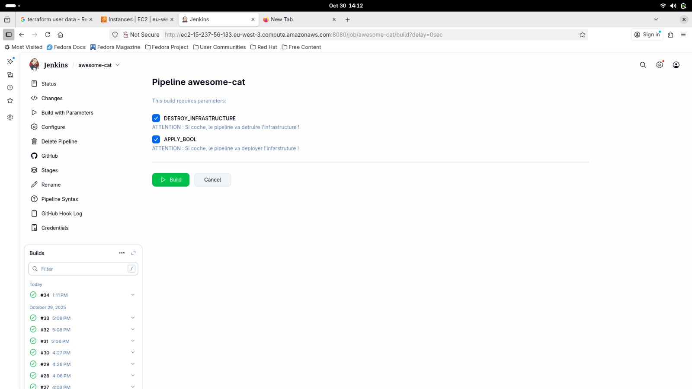
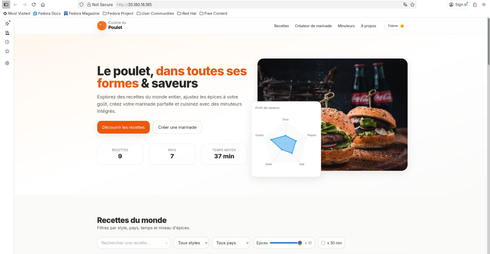

# **Cloud high-availability deployment**

Ce projet a pour but de vous initier aux technologies DevOps modernes telles que Terraform et Jenkins.

> [!CAUTION] 
> **Prérequis/Acquis:**
> - Connaissance basic sur la conteneurisation et virtualisation ( par exemple avec Docker) 
> - Connaissance sur l'ochestration de conteneur (Kubernetes)
> - avoir un compte AWS avec des credits (6 premiers mois gratuit)
> - avoir une bonne connaissances des service AWS (ici : VPC, EC2, S3)

**Objectif:**
Déployer une application web (ou tout autre service) dans le cloud en assurant une haute disponibilité. Nous utiliserons :
- Terraform pour l'Infrastructure as Code (IaC), gérant l'instanciation de nos serveurs AWS.
- Jenkins pour l'automatisation du déploiement (intégration et livraison continues - CI/CD).
Ce projet est a but educatif, donc on a fait une structure minimaliste.

> [!Note]
> **Remarque:**
> Jenkins doit tourner localement sur une machine, donc parmis les developpeurs il faut qu'une persones lance jenkins.
> Pour lancer sur 1 seul service il faut créer des rôle 

resultat : [un liens tu as compris]

# Installation
1. Mise en place de Jenkins et de Terraform sur une machine virtuel, afin de virtualiser l'ensemble du systeme et aussi assurer la disponibilté du service. 

2. Création de la pipeline sur Jenkins, configuration du webhook

3. Création d'instances EC2 et S3 via terraform, liaison via IAM

4. Déploiement d'un serveur http nginx

# Aperçu
notre build Jenkins :

resultat :

# A faire :

- Au lieu de redeployer a chaque modification utiliser Ansible pour ajouter configuration. (redeployer prend du temps)

- Ajout de notification mail jenkins avec l'url du site

-ajout d'un ALB (amazon load balancer)

# Miscellaneous

